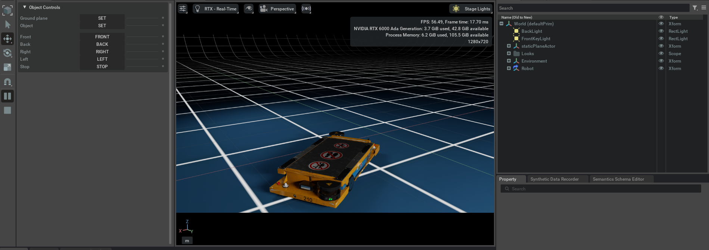

# IdealWorks移動

## Preview




## ソースコード

```python hl_lines="7 8 97-124 180-242"
import numpy as np
import omni.timeline
import omni.ui as ui
from omni.isaac.ui.element_wrappers import CollapsableFrame, DropDown, FloatField, TextBlock
from omni.isaac.ui.ui_utils import get_style
from omni.isaac.ui.element_wrappers import Button
from pxr import Usd, UsdGeom, Sdf, Gf, UsdPhysics, UsdShade,  PhysxSchema
import math
from omni.physx.scripts import physicsUtils
import omni.usd

class UIBuilder:
    def __init__(self):
        """enableの状態だとIsaac SIMが起動した際に1度呼び出される
        """
        # フレームは、複数のUI要素を含むことができるサブウィンドウです
        self.frames = []

        # UI要素は、omni.isaac.ui.element_wrappers の UIElementWrapper を使用して作成されます
        self.wrapped_ui_elements = []

        # タイムラインにアクセスして、プログラム上で停止/一時停止/再生を制御します
        self._timeline = omni.timeline.get_timeline_interface()

        # __on_init()を呼び出し
        self._on_init()

    def on_menu_callback(self):
        """ツールバーからUIが開かれたときに呼び出されるコールバック。 

        これは、build_ui()の直後に呼び出されます。
        """
        print("on_menu_callback")

    def on_timeline_event(self, event):
        """タイムラインイベント（再生、停止、一時停止）のコールバック

        Args: 
             event (omni.timeline.TimelineEventType): イベントの種類
        """
        #print("on_timeline_event")
        pass

    def on_physics_step(self, step):
        """物理ステップのコールバック。
        物理ステップは、タイムラインが再生されているときにのみ発生します

        Args:
            step (float): 物理ステップのサイズ
        """
        #print("on_physics_step")
        pass

    def on_stage_event(self, event):
        """ステージイベントのコールバック

        Args:
            event (omni.usd.StageEventType): イベントタイプ
        """
        print(f"event type: {event.type}")
        pass

    def cleanup(self):
        """
        ステージが閉じられたときや拡張機能がホットリロードされたときに呼び出されます。 
        必要なクリーンアップ処理を行い、アクティブなコールバック関数を削除します。 
        omni.isaac.ui.element_wrappersからインポートされたボタンは、
        クリーンアップ関数を実装しているので、それを呼び出す必要があります。
        """
        print("cleanup")
        for ui_elem in self.wrapped_ui_elements:
            ui_elem.cleanup()

    def build_ui(self):
        """
        カスタムUIツールを構築して、拡張機能を実行します。
        この関数は、UIウィンドウが閉じて再度開かれるたびに呼び出されます。
        """
        print("build_ui")

        # ボタンUIの作成
        object_map = CollapsableFrame("Object Controls", collapsed=False)

        with object_map:
            with ui.VStack(style=get_style(), spacing=5, height=0):
                with ui.VStack():
                    grandplate_button = Button(
                        "Ground plane",
                        "SET",
                        on_click_fn=self._on_set_groudplane,
                    )
                    robot_button = Button(
                        "Object",
                        "SET",
                        on_click_fn=self._on_set_object,
                    )
                    ui.Spacer(height=10)
                    front_button = Button(
                        "Front",
                        "front",
                        on_click_fn=self._on_front,
                    )
                    back_button = Button(
                        "Back",
                        "back",
                        on_click_fn=self._on_back,
                    )
                    right_button = Button(
                        "Right",
                        "right",
                        on_click_fn=self._on_right,
                    )
                    left_button = Button(
                        "Left",
                        "left",
                        on_click_fn=self._on_left,
                    )
                    stop_button = Button(
                        "Stop",
                        "stop",
                        on_click_fn=self._on_stop,
                    )

                self.wrapped_ui_elements.extend([grandplate_button, robot_button, front_button, back_button, right_button, left_button, stop_button])

    def _on_set_groudplane(self):
        """
        ボタンが押されたら呼ばれる
        """
        # シーンを読み込む
        usd_file_path = "http://omniverse-content-production.s3-us-west-2.amazonaws.com/Assets/Isaac/4.1/Isaac/Environments/Grid/gridroom_curved.usd"
        omni.usd.get_context().open_stage(usd_file_path)
        print("USDシーンがロードされました")
    
    def _on_set_object(self):
        """
        USDシーンにRobotオブジェクトを追加し、位置、スケール、回転、剛体物理と衝突設定を行う
        """
        # USDステージのコンテキストを取得
        context = omni.usd.get_context()
        stage = context.get_stage()  # self.stageではなく、ここで直接取得する

        # オブジェクトのパスを指定
        prim_path = '/World/Robot'

        # 現在の編集対象レイヤーを取得
        edit_target = stage.GetEditTarget()
        current_layer = edit_target.GetLayer()

        # 新しいプリム（オブジェクト）を作成
        prim_spec = Sdf.CreatePrimInLayer(current_layer, prim_path)

        # RobotオブジェクトのUSDファイルをペイロードとしてロード
        prim_spec.payloadList.Prepend(Sdf.Payload(
            'omniverse://localhost/NVIDIA/Assets/Isaac/4.2/Isaac/Robots/Idealworks/iw_hub_sensors.usd', 
            Sdf.Path.emptyPath))

        # Robotオブジェクトを取得
        robot_prim = stage.GetPrimAtPath(prim_path)

        # オブジェクトが正しく取得できたか確認
        if not robot_prim.IsValid():
            print(f"Error: Could not load prim at {prim_path}")
            return

        # Robotの位置、スケール、回転を設定
        xformable = UsdGeom.Xformable(robot_prim)

        # 位置を設定（既存の translate op があるか確認）
        if xformable.GetOrderedXformOps():
            translate_ops = [op for op in xformable.GetOrderedXformOps() if op.GetOpName() == 'xformOp:translate']
            if translate_ops:
                translate_ops[0].Set(Gf.Vec3f(0.0, 0.0, 1.0))
            else:
                xformable.AddTranslateOp().Set(Gf.Vec3f(0.0, 0.0, 1.0))
        else:
            xformable.AddTranslateOp().Set(Gf.Vec3f(0.0, 0.0, 1.0))


        # ホイールドライブを設定する際に、stageを参照
        self.left_wheel_drive = UsdPhysics.DriveAPI.Get(stage.GetPrimAtPath("/World/Robot/left_wheel_joint"), "angular")
        self.right_wheel_drive = UsdPhysics.DriveAPI.Get(stage.GetPrimAtPath("/World/Robot/right_wheel_joint"), "angular")

        print(f"Robot {prim_path} added, configured, and drives set.")


    def _on_right(self):
        print("right")
        self.set_drive_parameters(self.left_wheel_drive, "velocity", math.degrees(5), 0, math.radians(1e8))
        self.set_drive_parameters(self.right_wheel_drive, "velocity", math.degrees(-5), 0, math.radians(1e8))

    def _on_left(self):
        print("left")
        self.set_drive_parameters(self.left_wheel_drive, "velocity", math.degrees(-5), 0, math.radians(1e8))
        self.set_drive_parameters(self.right_wheel_drive, "velocity", math.degrees(5), 0, math.radians(1e8))

    def _on_front(self):
        print("front")
        self.set_drive_parameters(self.left_wheel_drive, "velocity", math.degrees(5), 0, math.radians(1e8))
        self.set_drive_parameters(self.right_wheel_drive, "velocity", math.degrees(5), 0, math.radians(1e8)) 

    def _on_back(self):
        print("back")
        self.set_drive_parameters(self.left_wheel_drive, "velocity", math.degrees(-5), 0, math.radians(1e8))
        self.set_drive_parameters(self.right_wheel_drive, "velocity", math.degrees(-5), 0, math.radians(1e8))

    def _on_stop(self):
        print("stop")
        self.set_drive_parameters(self.left_wheel_drive, "velocity", math.degrees(0), 0, math.radians(1e8))
        self.set_drive_parameters(self.right_wheel_drive, "velocity", math.degrees(0), 0, math.radians(1e8))
        
    def set_drive_parameters(self, drive, target_type, target_value, stiffness=None, damping=None, max_force=None):
        """Enable velocity drive for a given joint"""

        if target_type == "position":
            if not drive.GetTargetPositionAttr():
                drive.CreateTargetPositionAttr(target_value)
            else:
                drive.GetTargetPositionAttr().Set(target_value)
        elif target_type == "velocity":
            if not drive.GetTargetVelocityAttr():
                drive.CreateTargetVelocityAttr(target_value)
            else:
                drive.GetTargetVelocityAttr().Set(target_value)

        if stiffness is not None:
            if not drive.GetStiffnessAttr():
                drive.CreateStiffnessAttr(stiffness)
            else:
                drive.GetStiffnessAttr().Set(stiffness)

        if damping is not None:
            if not drive.GetDampingAttr():
                drive.CreateDampingAttr(damping)
            else:
                drive.GetDampingAttr().Set(damping)

        if max_force is not None:
            if not drive.GetMaxForceAttr():
                drive.CreateMaxForceAttr(max_force)
            else:
                drive.GetMaxForceAttr().Set(max_force)

    def _on_init(self):
        print("_on_init")
```

## Reference

- [https://docs.omniverse.nvidia.com/isaacsim/latest/features/environment_setup/assets/usd_assets_robots.html](https://docs.omniverse.nvidia.com/isaacsim/latest/features/environment_setup/assets/usd_assets_robots.html)