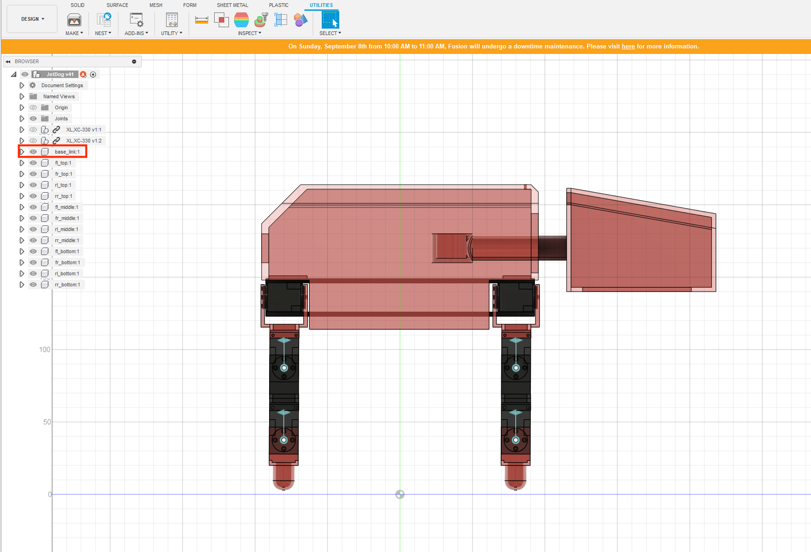
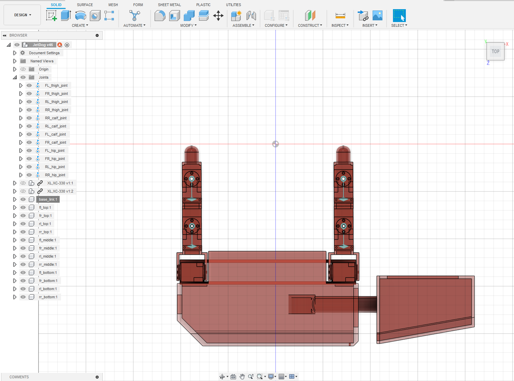
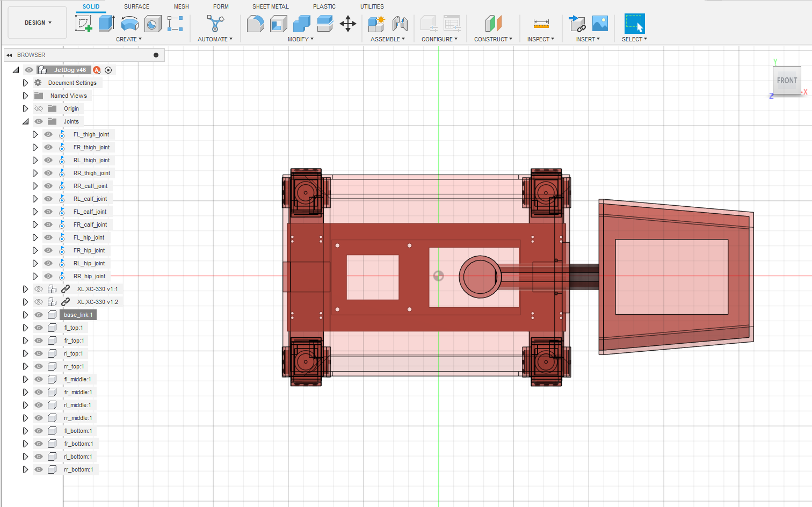
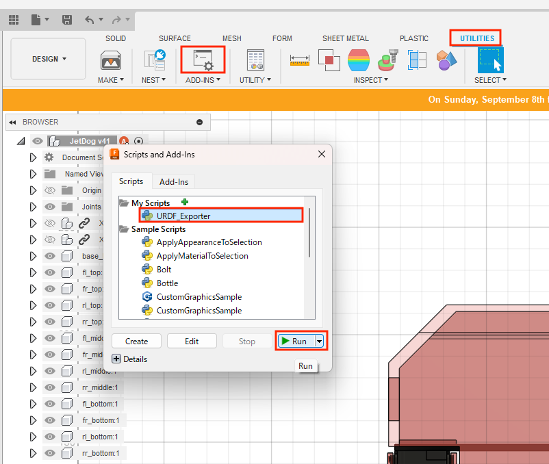
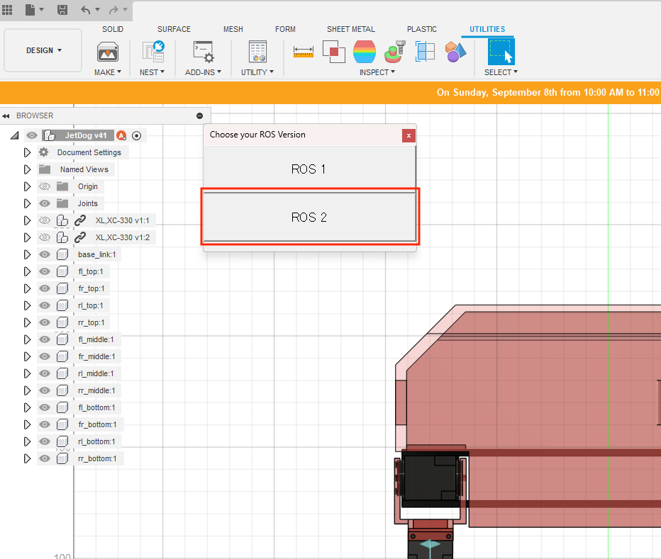

# URDFの出力

## Fusion360からURDFの出力

base_linkは必須



Fusion360の座標軸と変換後のＵＳＤの座標軸をわせるために、下記向きで調整する





Fusion360に、 https://github.com/syuntoku14/fusion2urdf を事前にいれておく





ROS2形式で出力

## ROS2でURDFに変換

Fusion360からはXacro形式で出力されるので、ROS2(Foxy)でURDF形式で出力する。

```shell
cd /home/ubuntu/ros2/src/akabeko_description/urdf/
ros2 run xacro xacro -o akabeko.urdf akabeko.xacro
```


