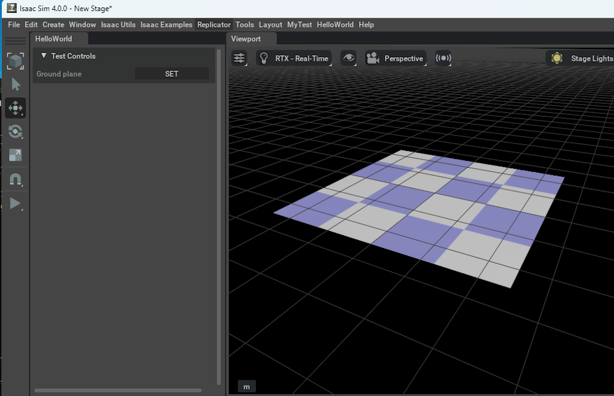

# GroundPlateにTextureを配置

## Preview




## ソースコード

```python hl_lines="103-120"
import numpy as np
import omni.timeline
import omni.ui as ui
from omni.isaac.ui.element_wrappers import CollapsableFrame, DropDown, FloatField, TextBlock
from omni.isaac.ui.ui_utils import get_style
from omni.isaac.ui.element_wrappers import Button
from pxr import Gf
from omni.physx.scripts import physicsUtils
import omni.usd

class UIBuilder:
    def __init__(self):
        """enableの状態だとIsaac SIMが起動した際に1度呼び出される
        """
        # フレームは、複数のUI要素を含むことができるサブウィンドウです
        self.frames = []

        # UI要素は、omni.isaac.ui.element_wrappers の UIElementWrapper を使用して作成されます
        self.wrapped_ui_elements = []

        # タイムラインにアクセスして、プログラム上で停止/一時停止/再生を制御します
        self._timeline = omni.timeline.get_timeline_interface()

        # __on_init()を呼び出し
        self._on_init()

    def on_menu_callback(self):
        """ツールバーからUIが開かれたときに呼び出されるコールバック。 

        これは、build_ui()の直後に呼び出されます。
        """
        print("on_menu_callback")

    def on_timeline_event(self, event):
        """タイムラインイベント（再生、停止、一時停止）のコールバック

        Args: 
             event (omni.timeline.TimelineEventType): イベントの種類
        """
        #print("on_timeline_event")
        pass

    def on_physics_step(self, step):
        """物理ステップのコールバック。
        物理ステップは、タイムラインが再生されているときにのみ発生します

        Args:
            step (float): 物理ステップのサイズ
        """
        #print("on_physics_step")
        pass

    def on_stage_event(self, event):
        """ステージイベントのコールバック

        Args:
            event (omni.usd.StageEventType): イベントタイプ
        """
        print(f"event type: {event.type}")
        pass

    def cleanup(self):
        """
        ステージが閉じられたときや拡張機能がホットリロードされたときに呼び出されます。 
        必要なクリーンアップ処理を行い、アクティブなコールバック関数を削除します。 
        omni.isaac.ui.element_wrappersからインポートされたボタンは、
        クリーンアップ関数を実装しているので、それを呼び出す必要があります。
        """
        print("cleanup")
        for ui_elem in self.wrapped_ui_elements:
            ui_elem.cleanup()

	def build_ui(self):
        """
        カスタムUIツールを構築して、拡張機能を実行します。
        この関数は、UIウィンドウが閉じて再度開かれるたびに呼び出されます。
        """
        print("build_ui")

        # ボタンUIの作成
        object_map = CollapsableFrame("Object Controls", collapsed=False)

        with object_map:
            with ui.VStack(style=get_style(), spacing=5, height=0):
                with ui.VStack():
                    grandplate_button = Button(
                        "Ground plane",
                        "SET",
                        on_click_fn=self._on_set_groudplane,
                    )

                self.wrapped_ui_elements.extend([grandplate_button])

    def _on_set_groudplane(self):
        """
        ボタンが押されたら呼ばれる
        """
        # シーンを取得
        self.stage = omni.usd.get_context().get_stage()
        # GroundPlaneを追加
        physicsUtils.add_ground_plane(self.stage, "/World/GroundPlane", "Z", 25.0, Gf.Vec3f(0, 0, 0), Gf.Vec3f(0.5))

        # Materialを作成
        mtl_path = Sdf.Path("/World/Looks/OmniPBR")
        mtl = UsdShade.Material.Define(self.stage, mtl_path)
        shader = UsdShade.Shader.Define(self.stage, mtl_path.AppendPath("Shader"))
        shader.CreateImplementationSourceAttr(UsdShade.Tokens.sourceAsset)
        shader.SetSourceAsset("OmniPBR.mdl", "mdl")
        shader.SetSourceAssetSubIdentifier("OmniPBR", "mdl")
        # NUCLEUSサーバからTextureを取得
        shader.CreateInput('diffuse_texture', Sdf.ValueTypeNames.Asset).Set("omniverse://localhost/NVIDIA/Assets/Terrain/105/materials/textures/blue.png")
        mtl.CreateSurfaceOutput("mdl").ConnectToSource(shader.ConnectableAPI(), "out")
        mtl.CreateDisplacementOutput("mdl").ConnectToSource(shader.ConnectableAPI(), "out")
        mtl.CreateVolumeOutput("mdl").ConnectToSource(shader.ConnectableAPI(), "out")

        # GroundPlaneのパスを取得
        ground_plane = self.stage.GetPrimAtPath("/World/GroundPlane")

        # MaterialをGroundPlaneにBind
        UsdShade.MaterialBindingAPI(ground_plane).Bind(mtl)

    def _on_init(self):
        print("_on_init")
```

## リソース

- [https://docs.omniverse.nvidia.com/kit/docs/omni_physics/104.0/source/extensions/omni.physx.commands/docs/index.html](https://docs.omniverse.nvidia.com/kit/docs/omni_physics/104.0/source/extensions/omni.physx.commands/docs/index.html)