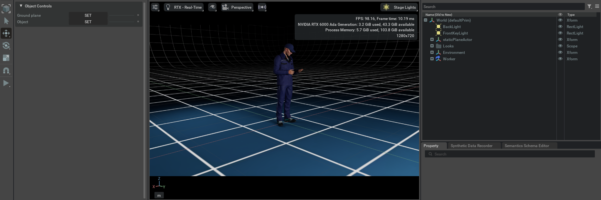

# Worker

## Preview




## ソースコード

```python hl_lines="7 108-167"
import numpy as np
import omni.timeline
import omni.ui as ui
from omni.isaac.ui.element_wrappers import CollapsableFrame, DropDown, FloatField, TextBlock
from omni.isaac.ui.ui_utils import get_style
from omni.isaac.ui.element_wrappers import Button
from pxr import Usd, UsdGeom, Sdf, Gf, UsdPhysics, UsdShade,  PhysxSchema
from omni.physx.scripts import physicsUtils
import omni.usd

class UIBuilder:
    def __init__(self):
        """enableの状態だとIsaac SIMが起動した際に1度呼び出される
        """
        # フレームは、複数のUI要素を含むことができるサブウィンドウです
        self.frames = []

        # UI要素は、omni.isaac.ui.element_wrappers の UIElementWrapper を使用して作成されます
        self.wrapped_ui_elements = []

        # タイムラインにアクセスして、プログラム上で停止/一時停止/再生を制御します
        self._timeline = omni.timeline.get_timeline_interface()

        # __on_init()を呼び出し
        self._on_init()

    def on_menu_callback(self):
        """ツールバーからUIが開かれたときに呼び出されるコールバック。 

        これは、build_ui()の直後に呼び出されます。
        """
        print("on_menu_callback")

    def on_timeline_event(self, event):
        """タイムラインイベント（再生、停止、一時停止）のコールバック

        Args: 
             event (omni.timeline.TimelineEventType): イベントの種類
        """
        #print("on_timeline_event")
        pass

    def on_physics_step(self, step):
        """物理ステップのコールバック。
        物理ステップは、タイムラインが再生されているときにのみ発生します

        Args:
            step (float): 物理ステップのサイズ
        """
        #print("on_physics_step")
        pass

    def on_stage_event(self, event):
        """ステージイベントのコールバック

        Args:
            event (omni.usd.StageEventType): イベントタイプ
        """
        print(f"event type: {event.type}")
        pass

    def cleanup(self):
        """
        ステージが閉じられたときや拡張機能がホットリロードされたときに呼び出されます。 
        必要なクリーンアップ処理を行い、アクティブなコールバック関数を削除します。 
        omni.isaac.ui.element_wrappersからインポートされたボタンは、
        クリーンアップ関数を実装しているので、それを呼び出す必要があります。
        """
        print("cleanup")
        for ui_elem in self.wrapped_ui_elements:
            ui_elem.cleanup()

    def build_ui(self):
        """
        カスタムUIツールを構築して、拡張機能を実行します。
        この関数は、UIウィンドウが閉じて再度開かれるたびに呼び出されます。
        """
        print("build_ui")

        # ボタンUIの作成
        object_map = CollapsableFrame("Object Controls", collapsed=False)

        with object_map:
            with ui.VStack(style=get_style(), spacing=5, height=0):
                with ui.VStack():
                    grandplate_button = Button(
                        "Ground plane",
                        "SET",
                        on_click_fn=self._on_set_groudplane,
                    )
                    robot_button = Button(
                        "Object",
                        "SET",
                        on_click_fn=self._on_set_object,
                    )

                self.wrapped_ui_elements.extend([grandplate_button, robot_button])

    def _on_set_groudplane(self):
        """
        ボタンが押されたら呼ばれる
        """
        # シーンを読み込む
        usd_file_path = "http://omniverse-content-production.s3-us-west-2.amazonaws.com/Assets/Isaac/4.1/Isaac/Environments/Grid/gridroom_curved.usd"
        omni.usd.get_context().open_stage(usd_file_path)
        print("USDシーンがロードされました")

    def _on_set_object(self):
        """
        USDシーンにWorkerオブジェクトを追加し、位置、スケール、回転、剛体物理と衝突設定を行う
        """
        # USDステージのコンテキストを取得
        context = omni.usd.get_context()
        stage = context.get_stage()

        # オブジェクトのパスを指定
        prim_path = '/World/Worker'

        # 現在の編集対象レイヤーを取得
        edit_target = stage.GetEditTarget()
        current_layer = edit_target.GetLayer()

        # 新しいプリム（オブジェクト）を作成
        prim_spec = Sdf.CreatePrimInLayer(current_layer, prim_path)

        # WorkerオブジェクトのUSDファイルをペイロードとしてロード
        prim_spec.payloadList.Prepend(Sdf.Payload(
            'omniverse://localhost/NVIDIA/Assets/Characters/Reallusion/Worker/Worker.usd', 
            Sdf.Path.emptyPath))

        # Workerオブジェクトを取得
        worker_prim = stage.GetPrimAtPath(prim_path)

        # オブジェクトが正しく取得できたか確認
        if not worker_prim.IsValid():
            print(f"Error: Could not load prim at {prim_path}")
            return

        # Workerの位置、スケール、回転を設定
        xformable = UsdGeom.Xformable(worker_prim)

        # 位置を設定
        xform_ops = xformable.AddTranslateOp()
        xform_ops.Set(Gf.Vec3f(0.0, 0.0, 0.0))

        # スケールを設定（全体を0.01倍に縮小）
        scale_ops = xformable.AddScaleOp()
        scale_ops.Set(Gf.Vec3f(0.01, 0.01, 0.01))

        # 回転を設定（X軸に対して180度、Y軸に対して180度）
        rotate_x_ops = xformable.AddRotateXOp()
        rotate_x_ops.Set(180.0)

        rotate_y_ops = xformable.AddRotateYOp()
        rotate_y_ops.Set(180.0)

        # 体物理やコリジョンを追加
        physicsAPI = UsdPhysics.RigidBodyAPI.Apply(worker_prim)
        PhysxSchema.PhysxRigidBodyAPI.Apply(worker_prim)
        physicsAPI.CreateRigidBodyEnabledAttr(True)

        # コリジョンの設定を追加
        collisionAPI = UsdPhysics.CollisionAPI.Apply(worker_prim)
        PhysxSchema.PhysxCollisionAPI.Apply(worker_prim)
        collisionAPI.CreateCollisionEnabledAttr().Set(True)

        print(f"Worker {prim_path} added, rotated by 180 degrees, and configured.")


    def _on_init(self):
        print("_on_init")
```
