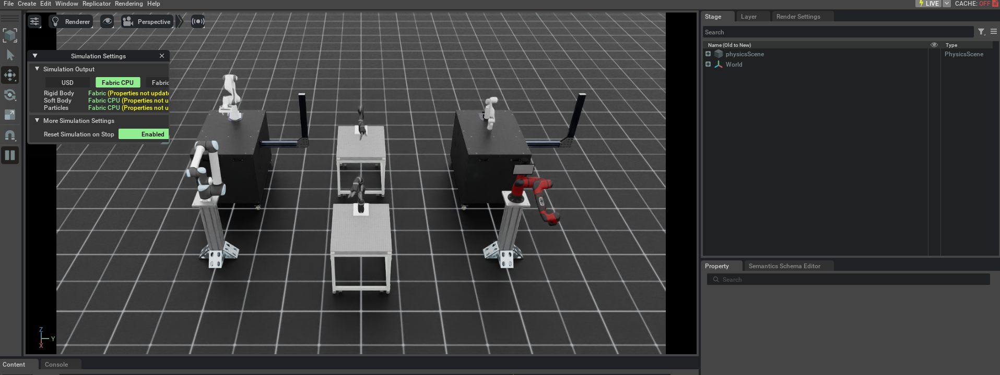

# armsサンプル

## Preview




## 起動コマンド

```shell
./isaaclab.bat -p source/standalone/demos/arms.py
```


## ソースコード(bipeds.py)

```python
# Copyright (c) 2022-2024, The Isaac Lab Project Developers.
# All rights reserved.
#
# SPDX-License-Identifier: BSD-3-Clause

"""
This script demonstrates different single-arm manipulators.

.. code-block:: bash

    # Usage
    ./isaaclab.sh -p source/standalone/demos/arms.py

"""

"""Launch Isaac Sim Simulator first."""

import argparse

from omni.isaac.lab.app import AppLauncher

# add argparse arguments
parser = argparse.ArgumentParser(description="This script demonstrates different single-arm manipulators.")
# append AppLauncher cli args
AppLauncher.add_app_launcher_args(parser)
# parse the arguments
args_cli = parser.parse_args()

# launch omniverse app
app_launcher = AppLauncher(args_cli)
simulation_app = app_launcher.app

"""Rest everything follows."""

import numpy as np
import torch

import omni.isaac.core.utils.prims as prim_utils

import omni.isaac.lab.sim as sim_utils
from omni.isaac.lab.assets import Articulation
from omni.isaac.lab.utils.assets import ISAAC_NUCLEUS_DIR

##
# Pre-defined configs
##
# isort: off
from omni.isaac.lab_assets import (
    FRANKA_PANDA_CFG,
    UR10_CFG,
    KINOVA_JACO2_N7S300_CFG,
    KINOVA_JACO2_N6S300_CFG,
    KINOVA_GEN3_N7_CFG,
    SAWYER_CFG,
)

# isort: on


def define_origins(num_origins: int, spacing: float) -> list[list[float]]:
    """Defines the origins of the the scene."""
    # create tensor based on number of environments
    env_origins = torch.zeros(num_origins, 3)
    # create a grid of origins
    num_rows = np.floor(np.sqrt(num_origins))
    num_cols = np.ceil(num_origins / num_rows)
    xx, yy = torch.meshgrid(torch.arange(num_rows), torch.arange(num_cols), indexing="xy")
    env_origins[:, 0] = spacing * xx.flatten()[:num_origins] - spacing * (num_rows - 1) / 2
    env_origins[:, 1] = spacing * yy.flatten()[:num_origins] - spacing * (num_cols - 1) / 2
    env_origins[:, 2] = 0.0
    # return the origins
    return env_origins.tolist()


def design_scene() -> tuple[dict, list[list[float]]]:
    """Designs the scene."""
    # Ground-plane
    cfg = sim_utils.GroundPlaneCfg()
    cfg.func("/World/defaultGroundPlane", cfg)
    # Lights
    cfg = sim_utils.DomeLightCfg(intensity=2000.0, color=(0.75, 0.75, 0.75))
    cfg.func("/World/Light", cfg)

    # Create separate groups called "Origin1", "Origin2", "Origin3"
    # Each group will have a mount and a robot on top of it
    origins = define_origins(num_origins=6, spacing=2.0)

    # Origin 1 with Franka Panda
    prim_utils.create_prim("/World/Origin1", "Xform", translation=origins[0])
    # -- Table
    cfg = sim_utils.UsdFileCfg(usd_path=f"{ISAAC_NUCLEUS_DIR}/Props/Mounts/SeattleLabTable/table_instanceable.usd")
    cfg.func("/World/Origin1/Table", cfg, translation=(0.55, 0.0, 1.05))
    # -- Robot
    franka_arm_cfg = FRANKA_PANDA_CFG.replace(prim_path="/World/Origin1/Robot")
    franka_arm_cfg.init_state.pos = (0.0, 0.0, 1.05)
    franka_panda = Articulation(cfg=franka_arm_cfg)

    # Origin 2 with UR10
    prim_utils.create_prim("/World/Origin2", "Xform", translation=origins[1])
    # -- Table
    cfg = sim_utils.UsdFileCfg(
        usd_path=f"{ISAAC_NUCLEUS_DIR}/Props/Mounts/Stand/stand_instanceable.usd", scale=(2.0, 2.0, 2.0)
    )
    cfg.func("/World/Origin2/Table", cfg, translation=(0.0, 0.0, 1.03))
    # -- Robot
    ur10_cfg = UR10_CFG.replace(prim_path="/World/Origin2/Robot")
    ur10_cfg.init_state.pos = (0.0, 0.0, 1.03)
    ur10 = Articulation(cfg=ur10_cfg)

    # Origin 3 with Kinova JACO2 (7-Dof) arm
    prim_utils.create_prim("/World/Origin3", "Xform", translation=origins[2])
    # -- Table
    cfg = sim_utils.UsdFileCfg(usd_path=f"{ISAAC_NUCLEUS_DIR}/Props/Mounts/ThorlabsTable/table_instanceable.usd")
    cfg.func("/World/Origin3/Table", cfg, translation=(0.0, 0.0, 0.8))
    # -- Robot
    kinova_arm_cfg = KINOVA_JACO2_N7S300_CFG.replace(prim_path="/World/Origin3/Robot")
    kinova_arm_cfg.init_state.pos = (0.0, 0.0, 0.8)
    kinova_j2n7s300 = Articulation(cfg=kinova_arm_cfg)

    # Origin 4 with Kinova JACO2 (6-Dof) arm
    prim_utils.create_prim("/World/Origin4", "Xform", translation=origins[3])
    # -- Table
    cfg = sim_utils.UsdFileCfg(usd_path=f"{ISAAC_NUCLEUS_DIR}/Props/Mounts/ThorlabsTable/table_instanceable.usd")
    cfg.func("/World/Origin4/Table", cfg, translation=(0.0, 0.0, 0.8))
    # -- Robot
    kinova_arm_cfg = KINOVA_JACO2_N6S300_CFG.replace(prim_path="/World/Origin4/Robot")
    kinova_arm_cfg.init_state.pos = (0.0, 0.0, 0.8)
    kinova_j2n6s300 = Articulation(cfg=kinova_arm_cfg)

    # Origin 5 with Sawyer
    prim_utils.create_prim("/World/Origin5", "Xform", translation=origins[4])
    # -- Table
    cfg = sim_utils.UsdFileCfg(usd_path=f"{ISAAC_NUCLEUS_DIR}/Props/Mounts/SeattleLabTable/table_instanceable.usd")
    cfg.func("/World/Origin5/Table", cfg, translation=(0.55, 0.0, 1.05))
    # -- Robot
    kinova_arm_cfg = KINOVA_GEN3_N7_CFG.replace(prim_path="/World/Origin5/Robot")
    kinova_arm_cfg.init_state.pos = (0.0, 0.0, 1.05)
    kinova_gen3n7 = Articulation(cfg=kinova_arm_cfg)

    # Origin 6 with Kinova Gen3 (7-Dof) arm
    prim_utils.create_prim("/World/Origin6", "Xform", translation=origins[5])
    # -- Table
    cfg = sim_utils.UsdFileCfg(
        usd_path=f"{ISAAC_NUCLEUS_DIR}/Props/Mounts/Stand/stand_instanceable.usd", scale=(2.0, 2.0, 2.0)
    )
    cfg.func("/World/Origin6/Table", cfg, translation=(0.0, 0.0, 1.03))
    # -- Robot
    sawyer_arm_cfg = SAWYER_CFG.replace(prim_path="/World/Origin6/Robot")
    sawyer_arm_cfg.init_state.pos = (0.0, 0.0, 1.03)
    sawyer = Articulation(cfg=sawyer_arm_cfg)

    # return the scene information
    scene_entities = {
        "franka_panda": franka_panda,
        "ur10": ur10,
        "kinova_j2n7s300": kinova_j2n7s300,
        "kinova_j2n6s300": kinova_j2n6s300,
        "kinova_gen3n7": kinova_gen3n7,
        "sawyer": sawyer,
    }
    return scene_entities, origins


def run_simulator(sim: sim_utils.SimulationContext, entities: dict[str, Articulation], origins: torch.Tensor):
    """Runs the simulation loop."""
    # Define simulation stepping
    sim_dt = sim.get_physics_dt()
    sim_time = 0.0
    count = 0
    # Simulate physics
    while simulation_app.is_running():
        # reset
        if count % 200 == 0:
            # reset counters
            sim_time = 0.0
            count = 0
            # reset the scene entities
            for index, robot in enumerate(entities.values()):
                # root state
                root_state = robot.data.default_root_state.clone()
                root_state[:, :3] += origins[index]
                robot.write_root_state_to_sim(root_state)
                # set joint positions
                joint_pos, joint_vel = robot.data.default_joint_pos.clone(), robot.data.default_joint_vel.clone()
                robot.write_joint_state_to_sim(joint_pos, joint_vel)
                # clear internal buffers
                robot.reset()
            print("[INFO]: Resetting robots state...")
        # apply random actions to the robots
        for robot in entities.values():
            # generate random joint positions
            joint_pos_target = robot.data.default_joint_pos + torch.randn_like(robot.data.joint_pos) * 0.1
            joint_pos_target = joint_pos_target.clamp_(
                robot.data.soft_joint_pos_limits[..., 0], robot.data.soft_joint_pos_limits[..., 1]
            )
            # apply action to the robot
            robot.set_joint_position_target(joint_pos_target)
            # write data to sim
            robot.write_data_to_sim()
        # perform step
        sim.step()
        # update sim-time
        sim_time += sim_dt
        count += 1
        # update buffers
        for robot in entities.values():
            robot.update(sim_dt)


def main():
    """Main function."""
    # Initialize the simulation context
    sim_cfg = sim_utils.SimulationCfg()
    sim = sim_utils.SimulationContext(sim_cfg)
    # Set main camera
    sim.set_camera_view([3.5, 0.0, 3.2], [0.0, 0.0, 0.5])
    # design scene
    scene_entities, scene_origins = design_scene()
    scene_origins = torch.tensor(scene_origins, device=sim.device)
    # Play the simulator
    sim.reset()
    # Now we are ready!
    print("[INFO]: Setup complete...")
    # Run the simulator
    run_simulator(sim, scene_entities, scene_origins)


if __name__ == "__main__":
    # run the main function
    main()
    # close sim app
    simulation_app.close()
```

## Config関連

- [omni.isaac.lab_assets.franka](https://github.com/isaac-sim/IsaacLab/blob/main/source/extensions/omni.isaac.lab_assets/omni/isaac/lab_assets/franka.py)
- [omni.isaac.lab_assets.universal_robots](https://github.com/isaac-sim/IsaacLab/blob/main/source/extensions/omni.isaac.lab_assets/omni/isaac/lab_assets/universal_robots.py)
- [omni.isaac.lab_assets.kinova](https://github.com/isaac-sim/IsaacLab/blob/main/source/extensions/omni.isaac.lab_assets/omni/isaac/lab_assets/kinova.py)


