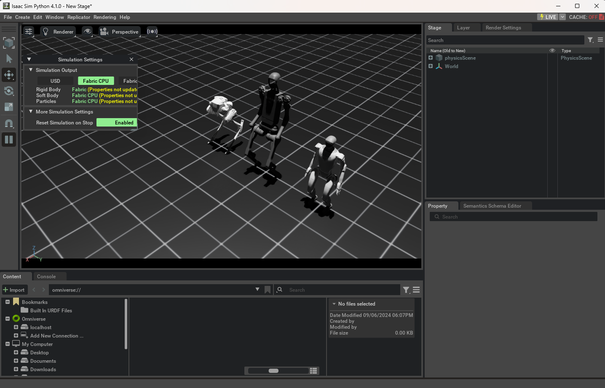

# bipedsサンプル

## Preview




## 起動コマンド

```shell
./isaaclab.bat -p source/standalone/demos/bipeds.py
```


## ソースコード(bipeds.py)

```python
# Copyright (c) 2022-2024, The Isaac Lab Project Developers.
# All rights reserved.
#
# SPDX-License-Identifier: BSD-3-Clause

"""
This script demonstrates how to simulate bipedal robots.

.. code-block:: bash

    # Usage
    ./isaaclab.sh -p source/standalone/demos/bipeds.py

"""

"""Launch Isaac Sim Simulator first."""

import argparse
import torch

from omni.isaac.lab.app import AppLauncher

# add argparse arguments
parser = argparse.ArgumentParser(description="This script demonstrates how to simulate bipedal robots.")
# append AppLauncher cli args
AppLauncher.add_app_launcher_args(parser)
# parse the arguments
args_cli = parser.parse_args()

# launch omniverse app
app_launcher = AppLauncher(args_cli)
simulation_app = app_launcher.app

"""Rest everything follows."""

import omni.isaac.lab.sim as sim_utils
from omni.isaac.lab.assets import Articulation
from omni.isaac.lab.sim import SimulationContext

##
# Pre-defined configs
##
from omni.isaac.lab_assets.cassie import CASSIE_CFG  # isort:skip
from omni.isaac.lab_assets import H1_CFG  # isort:skip
from omni.isaac.lab_assets import G1_CFG  # isort:skip


def main():
    """Main function."""

    # Load kit helper
    sim = SimulationContext(sim_utils.SimulationCfg(device="cpu", dt=0.01))
    # Set main camera
    sim.set_camera_view(eye=[3.5, 3.5, 3.5], target=[0.0, 0.0, 0.0])

    # Spawn things into stage
    # Ground-plane
    cfg = sim_utils.GroundPlaneCfg()
    cfg.func("/World/defaultGroundPlane", cfg)
    # Lights
    cfg = sim_utils.DistantLightCfg(intensity=3000.0, color=(0.75, 0.75, 0.75))
    cfg.func("/World/Light", cfg)

    origins = torch.tensor([
        [0.0, 0.0, 0.0],
        [0.0, 1.0, 0.0],
        [0.0, 2.0, 0.0],
    ])
    # Robots
    cassie = Articulation(CASSIE_CFG.replace(prim_path="/World/Cassie"))
    h1 = Articulation(H1_CFG.replace(prim_path="/World/H1"))
    g1 = Articulation(G1_CFG.replace(prim_path="/World/G1"))
    robots = [cassie, h1, g1]

    # Play the simulator
    sim.reset()

    # Now we are ready!
    print("[INFO]: Setup complete...")

    # Define simulation stepping
    sim_dt = sim.get_physics_dt()
    sim_time = 0.0
    count = 0
    # Simulate physics
    while simulation_app.is_running():
        # reset
        if count % 200 == 0:
            # reset counters
            sim_time = 0.0
            count = 0
            for index, robot in enumerate(robots):
                # reset dof state
                joint_pos, joint_vel = robot.data.default_joint_pos, robot.data.default_joint_vel
                robot.write_joint_state_to_sim(joint_pos, joint_vel)
                root_state = robot.data.default_root_state.clone()
                root_state[:, :3] += origins[index]
                robot.write_root_state_to_sim(root_state)
                robot.reset()
            # reset command
            print(">>>>>>>> Reset!")
        # apply action to the robot
        for robot in robots:
            robot.set_joint_position_target(robot.data.default_joint_pos.clone())
            robot.write_data_to_sim()
        # perform step
        sim.step()
        # update sim-time
        sim_time += sim_dt
        count += 1
        # update buffers
        for robot in robots:
            robot.update(sim_dt)


if __name__ == "__main__":
    # run the main function
    main()
    # close sim app
    simulation_app.close()
```

## Config関連

- [omni.isaac.lab_assets.unitree](https://github.com/isaac-sim/IsaacLab/blob/main/source/extensions/omni.isaac.lab_assets/omni/isaac/lab_assets/unitree.py)
- [omni.isaac.lab_assets.cassie](https://github.com/isaac-sim/IsaacLab/blob/main/source/extensions/omni.isaac.lab_assets/omni/isaac/lab_assets/cassie.py)


