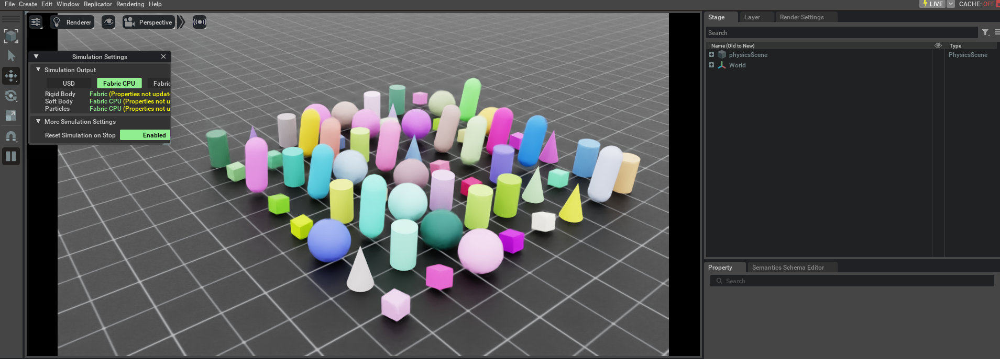

# deformablesサンプル

## Preview




## 起動コマンド

```shell
./isaaclab.bat -p source/standalone/demos/deformables.py
```


## ソースコード(deformable.py)

```python
# Copyright (c) 2022-2024, The Isaac Lab Project Developers.
# All rights reserved.
#
# SPDX-License-Identifier: BSD-3-Clause

"""This script demonstrates how to spawn deformable prims into the scene.

.. code-block:: bash

    # Usage
    ./isaaclab.sh -p source/standalone/demos/deformables.py

"""

"""Launch Isaac Sim Simulator first."""


import argparse

from omni.isaac.lab.app import AppLauncher

# create argparser
parser = argparse.ArgumentParser(description="This script demonstrates how to spawn deformable prims into the scene.")
# append AppLauncher cli args
AppLauncher.add_app_launcher_args(parser)
# parse the arguments
args_cli = parser.parse_args()
# launch omniverse app
app_launcher = AppLauncher(args_cli)
simulation_app = app_launcher.app

"""Rest everything follows."""

import numpy as np
import random
import torch
import tqdm

import omni.isaac.lab.sim as sim_utils
from omni.isaac.lab.assets import DeformableObject, DeformableObjectCfg


def define_origins(num_origins: int, spacing: float) -> list[list[float]]:
    """Defines the origins of the the scene."""
    # create tensor based on number of environments
    env_origins = torch.zeros(num_origins, 3)
    # create a grid of origins
    num_cols = np.floor(np.sqrt(num_origins))
    num_rows = np.ceil(num_origins / num_cols)
    xx, yy = torch.meshgrid(torch.arange(num_rows), torch.arange(num_cols), indexing="xy")
    env_origins[:, 0] = spacing * xx.flatten()[:num_origins] - spacing * (num_rows - 1) / 2
    env_origins[:, 1] = spacing * yy.flatten()[:num_origins] - spacing * (num_cols - 1) / 2
    env_origins[:, 2] = torch.rand(num_origins) + 1.0
    # return the origins
    return env_origins.tolist()


def design_scene() -> tuple[dict, list[list[float]]]:
    """Designs the scene."""
    # Ground-plane
    cfg_ground = sim_utils.GroundPlaneCfg()
    cfg_ground.func("/World/defaultGroundPlane", cfg_ground)

    # spawn distant light
    cfg_light = sim_utils.DomeLightCfg(
        intensity=3000.0,
        color=(0.75, 0.75, 0.75),
    )
    cfg_light.func("/World/light", cfg_light)

    # spawn a red cone
    cfg_sphere = sim_utils.MeshSphereCfg(
        radius=0.25,
        deformable_props=sim_utils.DeformableBodyPropertiesCfg(rest_offset=0.0),
        visual_material=sim_utils.PreviewSurfaceCfg(),
        physics_material=sim_utils.DeformableBodyMaterialCfg(),
    )
    cfg_cuboid = sim_utils.MeshCuboidCfg(
        size=(0.2, 0.2, 0.2),
        deformable_props=sim_utils.DeformableBodyPropertiesCfg(rest_offset=0.0),
        visual_material=sim_utils.PreviewSurfaceCfg(),
        physics_material=sim_utils.DeformableBodyMaterialCfg(),
    )
    cfg_cylinder = sim_utils.MeshCylinderCfg(
        radius=0.15,
        height=0.5,
        deformable_props=sim_utils.DeformableBodyPropertiesCfg(rest_offset=0.0),
        visual_material=sim_utils.PreviewSurfaceCfg(),
        physics_material=sim_utils.DeformableBodyMaterialCfg(),
    )
    cfg_capsule = sim_utils.MeshCapsuleCfg(
        radius=0.15,
        height=0.5,
        deformable_props=sim_utils.DeformableBodyPropertiesCfg(rest_offset=0.0),
        visual_material=sim_utils.PreviewSurfaceCfg(),
        physics_material=sim_utils.DeformableBodyMaterialCfg(),
    )
    cfg_cone = sim_utils.MeshConeCfg(
        radius=0.15,
        height=0.5,
        deformable_props=sim_utils.DeformableBodyPropertiesCfg(rest_offset=0.0),
        visual_material=sim_utils.PreviewSurfaceCfg(),
        physics_material=sim_utils.DeformableBodyMaterialCfg(),
    )
    # create a dictionary of all the objects to be spawned
    objects_cfg = {
        "sphere": cfg_sphere,
        "cuboid": cfg_cuboid,
        "cylinder": cfg_cylinder,
        "capsule": cfg_capsule,
        "cone": cfg_cone,
    }

    # Create separate groups of deformable objects
    origins = define_origins(num_origins=64, spacing=0.6)
    print("[INFO]: Spawning objects...")
    # Iterate over all the origins and randomly spawn objects
    for idx, origin in tqdm.tqdm(enumerate(origins), total=len(origins)):
        # randomly select an object to spawn
        obj_name = random.choice(list(objects_cfg.keys()))
        obj_cfg = objects_cfg[obj_name]
        # randomize the young modulus (somewhere between a Silicone 30 and Silicone 70)
        obj_cfg.physics_material.youngs_modulus = random.uniform(0.7e6, 3.3e6)
        # randomize the poisson's ratio
        obj_cfg.physics_material.poissons_ratio = random.uniform(0.25, 0.5)
        # randomize the color
        obj_cfg.visual_material.diffuse_color = (random.random(), random.random(), random.random())
        # spawn the object
        obj_cfg.func(f"/World/Origin/Object{idx:02d}", obj_cfg, translation=origin)

    # create a view for all the deformables
    # note: since we manually spawned random deformable meshes above, we don't need to
    #   specify the spawn configuration for the deformable object
    cfg = DeformableObjectCfg(
        prim_path="/World/Origin/Object.*",
        spawn=None,
        init_state=DeformableObjectCfg.InitialStateCfg(),
    )
    deformable_object = DeformableObject(cfg=cfg)

    # return the scene information
    scene_entities = {"deformable_object": deformable_object}
    return scene_entities, origins


def run_simulator(sim: sim_utils.SimulationContext, entities: dict[str, DeformableObject], origins: torch.Tensor):
    """Runs the simulation loop."""
    # Define simulation stepping
    sim_dt = sim.get_physics_dt()
    sim_time = 0.0
    count = 0
    # Simulate physics
    while simulation_app.is_running():
        # reset
        if count % 400 == 0:
            # reset counters
            sim_time = 0.0
            count = 0
            # reset deformable object state
            for _, deform_body in enumerate(entities.values()):
                # root state
                nodal_state = deform_body.data.default_nodal_state_w.clone()
                deform_body.write_nodal_state_to_sim(nodal_state)
                # reset the internal state
                deform_body.reset()
            print("[INFO]: Resetting deformable object state...")
        # perform step
        sim.step()
        # update sim-time
        sim_time += sim_dt
        count += 1
        # update buffers
        for deform_body in entities.values():
            deform_body.update(sim_dt)


def main():
    """Main function."""
    # Initialize the simulation context
    sim_cfg = sim_utils.SimulationCfg(dt=0.01)
    sim = sim_utils.SimulationContext(sim_cfg)
    # Set main camera
    sim.set_camera_view([4.0, 4.0, 3.0], [0.5, 0.5, 0.0])

    # Design scene by adding assets to it
    scene_entities, scene_origins = design_scene()
    scene_origins = torch.tensor(scene_origins, device=sim.device)
    # Play the simulator
    sim.reset()
    # Now we are ready!
    print("[INFO]: Setup complete...")

    # Run the simulator
    run_simulator(sim, scene_entities, scene_origins)


if __name__ == "__main__":
    # run the main function
    main()
    # close sim app
    simulation_app.close()
```


