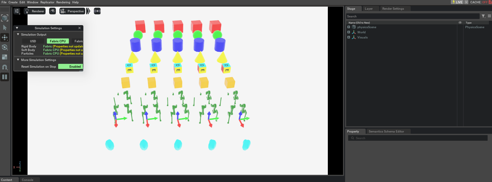

# markersサンプル

## Preview




## 起動コマンド

```shell
./isaaclab.bat -p source/standalone/demos/markers.py
```


## ソースコード(markers.py)

```python
# Copyright (c) 2022-2024, The Isaac Lab Project Developers.
# All rights reserved.
#
# SPDX-License-Identifier: BSD-3-Clause

"""This script demonstrates different types of markers.

.. code-block:: bash

    # Usage
    ./isaaclab.sh -p source/standalone/demos/markers.py

"""

"""Launch Isaac Sim Simulator first."""

import argparse

from omni.isaac.lab.app import AppLauncher

# add argparse arguments
parser = argparse.ArgumentParser(description="This script demonstrates different types of markers.")
# append AppLauncher cli args
AppLauncher.add_app_launcher_args(parser)
# parse the arguments
args_cli = parser.parse_args()

# launch omniverse app
app_launcher = AppLauncher(args_cli)
simulation_app = app_launcher.app

"""Rest everything follows."""

import torch

import omni.isaac.lab.sim as sim_utils
from omni.isaac.lab.markers import VisualizationMarkers, VisualizationMarkersCfg
from omni.isaac.lab.sim import SimulationContext
from omni.isaac.lab.utils.assets import ISAAC_NUCLEUS_DIR, ISAACLAB_NUCLEUS_DIR
from omni.isaac.lab.utils.math import quat_from_angle_axis


def define_markers() -> VisualizationMarkers:
    """Define markers with various different shapes."""
    marker_cfg = VisualizationMarkersCfg(
        prim_path="/Visuals/myMarkers",
        markers={
            "frame": sim_utils.UsdFileCfg(
                usd_path=f"{ISAAC_NUCLEUS_DIR}/Props/UIElements/frame_prim.usd",
                scale=(0.5, 0.5, 0.5),
            ),
            "arrow_x": sim_utils.UsdFileCfg(
                usd_path=f"{ISAAC_NUCLEUS_DIR}/Props/UIElements/arrow_x.usd",
                scale=(1.0, 0.5, 0.5),
                visual_material=sim_utils.PreviewSurfaceCfg(diffuse_color=(0.0, 1.0, 1.0)),
            ),
            "cube": sim_utils.CuboidCfg(
                size=(1.0, 1.0, 1.0),
                visual_material=sim_utils.PreviewSurfaceCfg(diffuse_color=(1.0, 0.0, 0.0)),
            ),
            "sphere": sim_utils.SphereCfg(
                radius=0.5,
                visual_material=sim_utils.PreviewSurfaceCfg(diffuse_color=(0.0, 1.0, 0.0)),
            ),
            "cylinder": sim_utils.CylinderCfg(
                radius=0.5,
                height=1.0,
                visual_material=sim_utils.PreviewSurfaceCfg(diffuse_color=(0.0, 0.0, 1.0)),
            ),
            "cone": sim_utils.ConeCfg(
                radius=0.5,
                height=1.0,
                visual_material=sim_utils.PreviewSurfaceCfg(diffuse_color=(1.0, 1.0, 0.0)),
            ),
            "mesh": sim_utils.UsdFileCfg(
                usd_path=f"{ISAAC_NUCLEUS_DIR}/Props/Blocks/DexCube/dex_cube_instanceable.usd",
                scale=(10.0, 10.0, 10.0),
            ),
            "mesh_recolored": sim_utils.UsdFileCfg(
                usd_path=f"{ISAAC_NUCLEUS_DIR}/Props/Blocks/DexCube/dex_cube_instanceable.usd",
                scale=(10.0, 10.0, 10.0),
                visual_material=sim_utils.PreviewSurfaceCfg(diffuse_color=(1.0, 0.25, 0.0)),
            ),
            "robot_mesh": sim_utils.UsdFileCfg(
                usd_path=f"{ISAACLAB_NUCLEUS_DIR}/Robots/ANYbotics/ANYmal-D/anymal_d.usd",
                scale=(2.0, 2.0, 2.0),
                visual_material=sim_utils.GlassMdlCfg(glass_color=(0.0, 0.1, 0.0)),
            ),
        },
    )
    return VisualizationMarkers(marker_cfg)


def main():
    """Main function."""
    # Load kit helper
    sim = SimulationContext(sim_utils.SimulationCfg(dt=0.01))
    # Set main camera
    sim.set_camera_view([0.0, 18.0, 12.0], [0.0, 3.0, 0.0])

    # Spawn things into stage
    # Lights
    cfg = sim_utils.DomeLightCfg(intensity=3000.0, color=(0.75, 0.75, 0.75))
    cfg.func("/World/Light", cfg)

    # create markers
    my_visualizer = define_markers()

    # define a grid of positions where the markers should be placed
    num_markers_per_type = 5
    grid_spacing = 2.0
    # Calculate the half-width and half-height
    half_width = (num_markers_per_type - 1) / 2.0
    half_height = (my_visualizer.num_prototypes - 1) / 2.0
    # Create the x and y ranges centered around the origin
    x_range = torch.arange(-half_width * grid_spacing, (half_width + 1) * grid_spacing, grid_spacing)
    y_range = torch.arange(-half_height * grid_spacing, (half_height + 1) * grid_spacing, grid_spacing)
    # Create the grid
    x_grid, y_grid = torch.meshgrid(x_range, y_range, indexing="ij")
    x_grid = x_grid.reshape(-1)
    y_grid = y_grid.reshape(-1)
    z_grid = torch.zeros_like(x_grid)
    # marker locations
    marker_locations = torch.stack([x_grid, y_grid, z_grid], dim=1)
    marker_indices = torch.arange(my_visualizer.num_prototypes).repeat(num_markers_per_type)

    # Play the simulator
    sim.reset()
    # Now we are ready!
    print("[INFO]: Setup complete...")

    # Yaw angle
    yaw = torch.zeros_like(marker_locations[:, 0])
    # Simulate physics
    while simulation_app.is_running():
        # rotate the markers around the z-axis for visualization
        marker_orientations = quat_from_angle_axis(yaw, torch.tensor([0.0, 0.0, 1.0]))
        # visualize
        my_visualizer.visualize(marker_locations, marker_orientations, marker_indices=marker_indices)
        # roll corresponding indices to show how marker prototype can be changed
        if yaw[0].item() % (0.5 * torch.pi) < 0.01:
            marker_indices = torch.roll(marker_indices, 1)
        # perform step
        sim.step()
        # increment yaw
        yaw += 0.01


if __name__ == "__main__":
    # run the main function
    main()
    # close sim app
    simulation_app.close()
```


