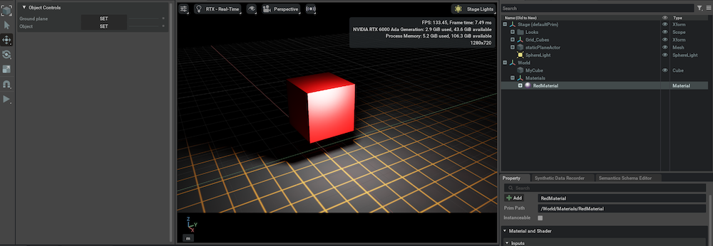

# Cubeを赤色

## Preview




## ソースコード

```python hl_lines="7 126-144"
import numpy as np
import omni.timeline
import omni.ui as ui
from omni.isaac.ui.element_wrappers import CollapsableFrame, DropDown, FloatField, TextBlock
from omni.isaac.ui.ui_utils import get_style
from omni.isaac.ui.element_wrappers import Button
from pxr import Usd, UsdGeom, Sdf, Gf, UsdPhysics
from omni.physx.scripts import physicsUtils
import omni.usd

class UIBuilder:
    def __init__(self):
        """enableの状態だとIsaac SIMが起動した際に1度呼び出される
        """
        # フレームは、複数のUI要素を含むことができるサブウィンドウです
        self.frames = []

        # UI要素は、omni.isaac.ui.element_wrappers の UIElementWrapper を使用して作成されます
        self.wrapped_ui_elements = []

        # タイムラインにアクセスして、プログラム上で停止/一時停止/再生を制御します
        self._timeline = omni.timeline.get_timeline_interface()

        # __on_init()を呼び出し
        self._on_init()

    def on_menu_callback(self):
        """ツールバーからUIが開かれたときに呼び出されるコールバック。 

        これは、build_ui()の直後に呼び出されます。
        """
        print("on_menu_callback")

    def on_timeline_event(self, event):
        """タイムラインイベント（再生、停止、一時停止）のコールバック

        Args: 
             event (omni.timeline.TimelineEventType): イベントの種類
        """
        #print("on_timeline_event")
        pass

    def on_physics_step(self, step):
        """物理ステップのコールバック。
        物理ステップは、タイムラインが再生されているときにのみ発生します

        Args:
            step (float): 物理ステップのサイズ
        """
        #print("on_physics_step")
        pass

    def on_stage_event(self, event):
        """ステージイベントのコールバック

        Args:
            event (omni.usd.StageEventType): イベントタイプ
        """
        print(f"event type: {event.type}")
        pass

    def cleanup(self):
        """
        ステージが閉じられたときや拡張機能がホットリロードされたときに呼び出されます。 
        必要なクリーンアップ処理を行い、アクティブなコールバック関数を削除します。 
        omni.isaac.ui.element_wrappersからインポートされたボタンは、
        クリーンアップ関数を実装しているので、それを呼び出す必要があります。
        """
        print("cleanup")
        for ui_elem in self.wrapped_ui_elements:
            ui_elem.cleanup()

    def build_ui(self):
        """
        カスタムUIツールを構築して、拡張機能を実行します。
        この関数は、UIウィンドウが閉じて再度開かれるたびに呼び出されます。
        """
        print("build_ui")

        # ボタンUIの作成
        object_map = CollapsableFrame("Object Controls", collapsed=False)

        with object_map:
            with ui.VStack(style=get_style(), spacing=5, height=0):
                with ui.VStack():
                    grandplate_button = Button(
                        "Ground plane",
                        "SET",
                        on_click_fn=self._on_set_groudplane,
                    )
                    robot_button = Button(
                        "Object",
                        "SET",
                        on_click_fn=self._on_set_object,
                    )

                self.wrapped_ui_elements.extend([grandplate_button, robot_button])

    def _on_set_groudplane(self):
        """
        ボタンが押されたら呼ばれる
        """
        # シーンを読み込む
        usd_file_path = "http://omniverse-content-production.s3-us-west-2.amazonaws.com/Assets/Isaac/4.1/Isaac/Environments/Grid/gridroom_black.usd"
        omni.usd.get_context().open_stage(usd_file_path)
        print("USDシーンがロードされました")

    def _on_set_object(self):
        """Cubeを追加して剛体を設定し、赤色を適用"""
        stage = omni.usd.get_context().get_stage()
        cube_path = Sdf.Path("/World/MyCube")

        # Cubeを定義
        cube = UsdGeom.Cube.Define(stage, cube_path)

        # Cubeの位置とサイズを設定
        cube_xform = UsdGeom.XformCommonAPI(cube.GetPrim())
        cube_xform.SetTranslate(Gf.Vec3d(0.0, 0.0, 2.0))  # 高さを2に設定

        # 剛体を追加
        rigid_body = UsdPhysics.RigidBodyAPI.Apply(cube.GetPrim())

        # コライダーを追加
        UsdPhysics.CollisionAPI.Apply(cube.GetPrim())

        # 色情報（赤色）の追加
        material_path = Sdf.Path("/World/Materials/RedMaterial")
        material_prim = stage.GetPrimAtPath(material_path)

        if not material_prim.IsValid():
            material = UsdShade.Material.Define(stage, material_path)
            pbr_shader = UsdShade.Shader.Define(stage, material_path.AppendPath("PBRShader"))
            pbr_shader.CreateIdAttr("UsdPreviewSurface")

            # 赤色に設定
            pbr_shader.CreateInput("diffuseColor", Sdf.ValueTypeNames.Color3f).Set(Gf.Vec3f(1.0, 0.0, 0.0))

            # シェーダーをマテリアルに適用
            material.CreateSurfaceOutput().ConnectToSource(pbr_shader.ConnectableAPI(), "surface")

        # Cubeにマテリアルをバインド
        UsdShade.MaterialBindingAPI(cube.GetPrim()).Bind(material)

        print(f"Cube {cube.GetPath()} に剛体と赤色が追加されました")

        # 画面を更新して表示
        omni.usd.get_context().get_stage_view().invalidate()


    def _on_init(self):
        print("_on_init")
```
