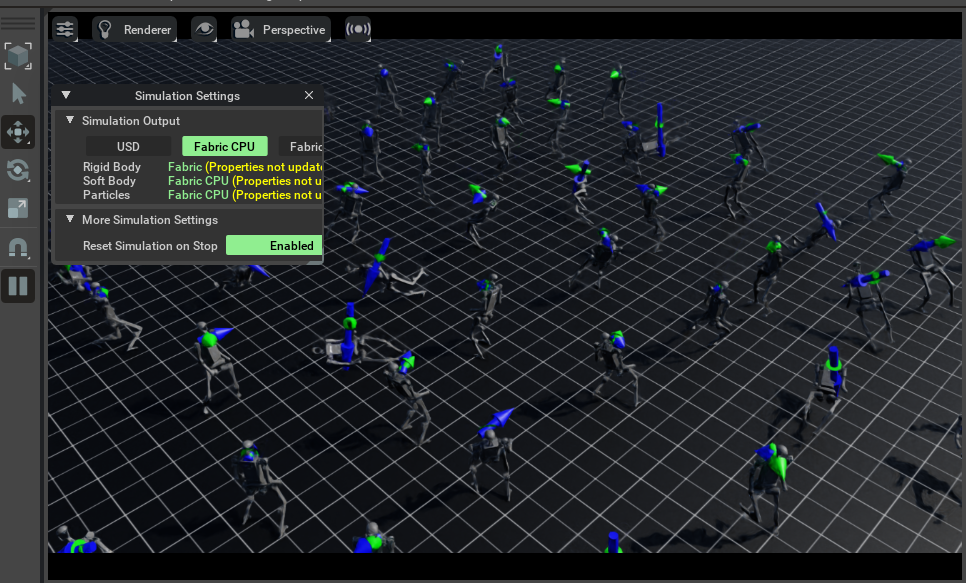
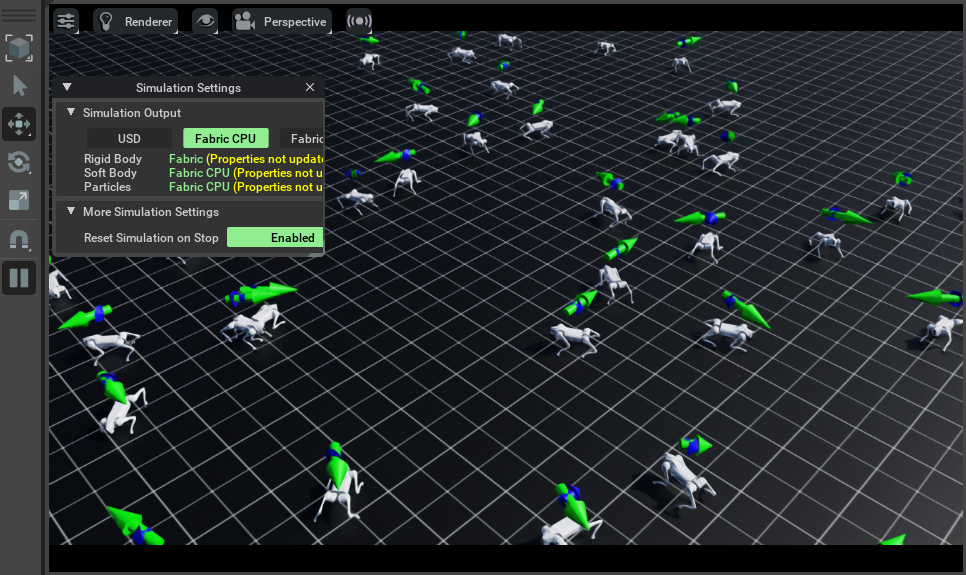
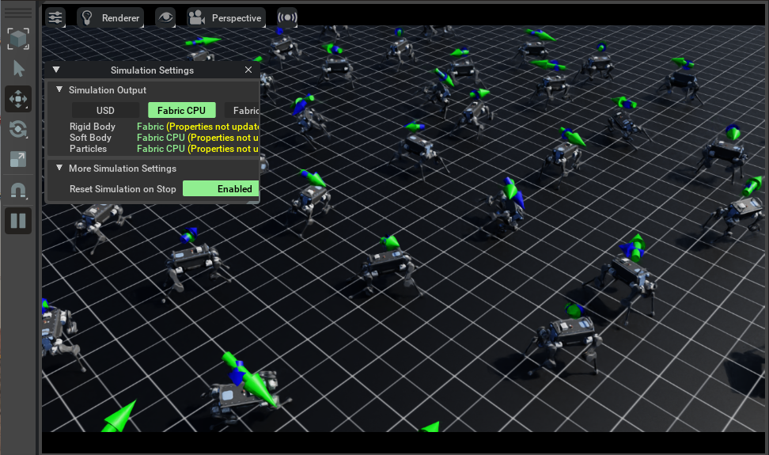
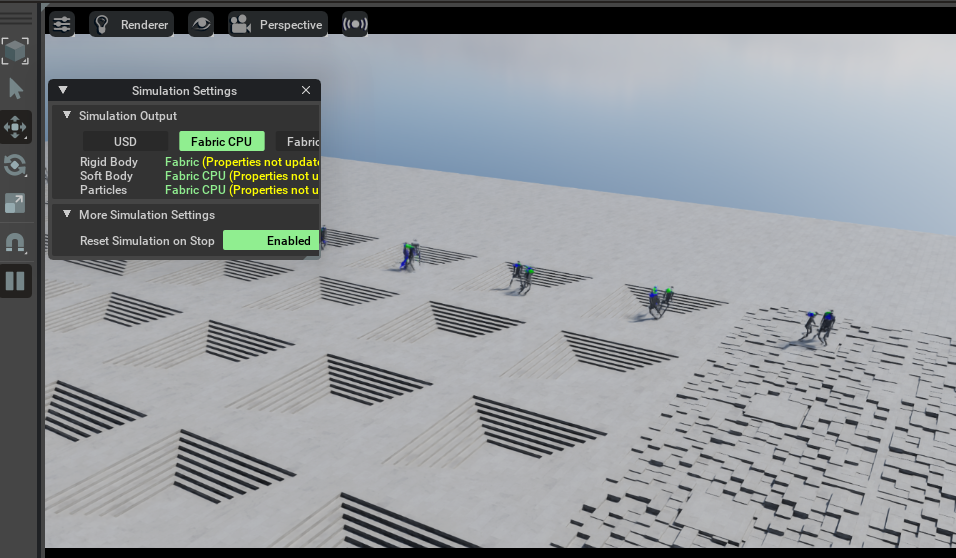

# RSL_RL

## Isaac-Velocity-Flat-H1-v0



```shell
./isaaclab.bat -p source/standalone/workflows/rsl_rl/train.py --task Isaac-Velocity-Flat-H1-v0 --num_envs 64
```

## Isaac-Velocity-Flat-Unitree-Go2-v0




```shell
./isaaclab.bat -p source/standalone/workflows/rsl_rl/train.py --task Isaac-Velocity-Flat-Unitree-Go2-v0 --num_envs 64
```

## Isaac-Velocity-Flat-Anymal-B-v0




```shell
 ./isaaclab.bat -p source/standalone/workflows/rsl_rl/train.py --task Isaac-Velocity-Flat-Anymal-B-v0 --num_envs 64
```

## Isaac-Velocity-Rough-H1-v0



```shell
./isaaclab.bat -p source/standalone/workflows/rsl_rl/train.py --task Isaac-Velocity-Rough-H1-v0 --num_envs 64
```

## Reference

- [https://github.com/isaac-sim/IsaacLab/blob/main/source/standalone/workflows/rsl_rl/train.py](https://github.com/isaac-sim/IsaacLab/blob/main/source/standalone/workflows/rsl_rl/train.py)
