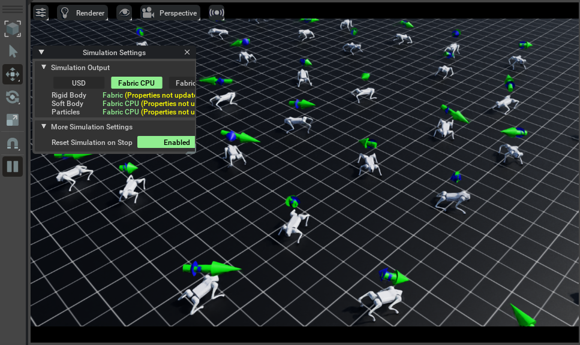
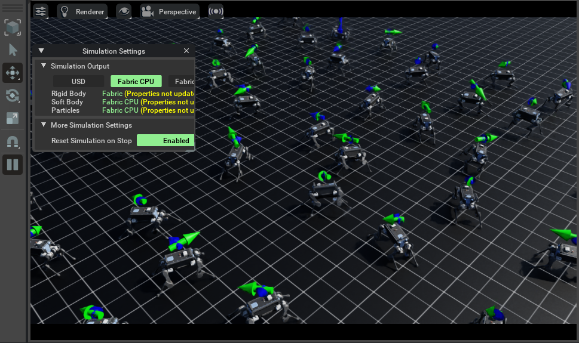

# SKRL

## Isaac-Velocity-Flat-Unitree-Go2-v0




```shell
./isaaclab.bat -p source/standalone/workflows/skrl/train.py --task Isaac-Velocity-Flat-Unitree-Go2-v0 --num_envs 64
```

## Isaac-Velocity-Flat-Anymal-B-v0




```shell
./isaaclab.bat -p source/standalone/workflows/skrl/train.py --task Isaac-Velocity-Flat-Anymal-B-v0 --num_envs 64
```
