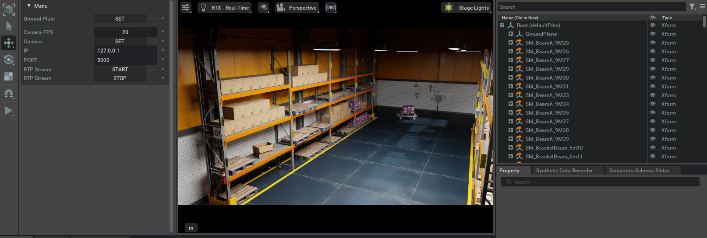

# RTPでの配信

## Preview



GStreamerでの受信

```shell
gst-launch-1.0 udpsrc port=5000 caps="application/x-rtp,
media=(string)video, clock-rate=(int)90000,
encoding-name=(string)JPEG, payload=(int)26" ! rtpjpegdepay ! jpegdec
! autovideosink
```


## ソースコード

```python
import numpy as np
import omni.timeline
import omni.ui as ui
from omni.isaac.ui.element_wrappers import (
    Button,
    CollapsableFrame,
    IntField,
    StringField,
)
from omni.isaac.ui.ui_utils import get_style
from pxr import Usd, UsdGeom, Gf
import omni.usd
from omni.isaac.sensor import Camera
import omni.isaac.core.utils.numpy.rotations as rot_utils
import threading
import asyncio
import socket
import struct
import time
from PIL import Image
import io

class UIBuilder:
    def __init__(self):
        """
        初期化メソッド。
        Isaac SIMが起動した際に一度呼び出されます。
        """
        # UI要素のリストを初期化
        self.wrapped_ui_elements = []
    
        # タイムラインインターフェースを取得（再生・停止・一時停止を制御します）
        self._timeline = omni.timeline.get_timeline_interface()
    
        # カメラセンサーの初期化
        self.camera_sensor = None
    
        # カメラの回転がアクティブかどうかのフラグ
        self.rotation_active = False

    def on_menu_callback(self):
        """
        ツールバーからUIが開かれたときに呼び出されるコールバック。
        build_ui()の直後に呼び出されます。
        """
        print("on_menu_callback")

    def on_timeline_event(self, event):
        """
        タイムラインイベント（再生、停止、一時停止）のコールバック。

        Args:
            event (omni.timeline.TimelineEventType): イベントの種類
        """
        # イベントの処理をここに記述します（必要に応じて）
        pass

    def on_physics_step(self, dt):
        """
        物理ステップごとに呼び出されるコールバック。
        タイムラインが再生されているときにのみ発生します。

        Args:
            dt (float): 物理ステップのサイズ
        """
        if self.rotation_active and self.camera_sensor:
            # ステージからカメラのプライムパスを取得します
            stage = omni.usd.get_context().get_stage()
            prim = stage.GetPrimAtPath(self.camera_sensor.prim_path)
            if not prim.IsValid():
                print(f"カメラのプライムパス {self.camera_sensor.prim_path} が無効です。")
                return

            # カメラのXformable APIを使用して変換操作を取得します
            xformable = UsdGeom.Xformable(prim)
            xform_ops = xformable.GetOrderedXformOps()

            # 既存の回転操作を検索します。なければ新規に作成します
            rotate_op = None
            for op in xform_ops:
                if op.GetOpType() == UsdGeom.XformOp.TypeRotateXYZ:
                    rotate_op = op
                    break
            if rotate_op is None:
                rotate_op = xformable.AddXformOp(
                    UsdGeom.XformOp.TypeRotateXYZ,
                    UsdGeom.XformOp.PrecisionDouble
                )

            # 現在の回転角度を取得します
            current_rotation = rotate_op.Get(Usd.TimeCode.Default())
            if current_rotation is None:
                current_rotation = Gf.Vec3d(0.0, 0.0, 0.0)

            # y軸周りの回転角度を更新します
            delta_angle = 1.0  # フレームごとの回転角度（度）
            new_rotation = Gf.Vec3d(
                current_rotation[0],
                (current_rotation[1] + delta_angle) % 360.0,
                current_rotation[2]
            )

            # 新しい回転角度を設定します
            rotate_op.Set(new_rotation, Usd.TimeCode.Default())

    def on_stage_event(self, event):
        """
        ステージイベントのコールバック。

        Args:
            event (omni.usd.StageEventType): イベントタイプ
        """
        print(f"event type: {event.type}")
        # 必要に応じてイベントの処理を記述します
        pass

    def cleanup(self):
        """
        ステージが閉じられたときや拡張機能がホットリロードされたときに呼び出されます。
        必要なクリーンアップ処理を行い、アクティブなコールバック関数を削除します。
        """
        print("cleanup")
        # UIエレメントのクリーンアップ
        for ui_elem in self.wrapped_ui_elements:
            ui_elem.cleanup()
        # ストリーミングがアクティブであれば停止します
        if hasattr(self, 'streaming_active') and self.streaming_active:
            self.streaming_active = False
            if hasattr(self, 'streaming_thread'):
                self.streaming_thread.join()
                del self.streaming_thread
            if hasattr(self, 'sock'):
                self.sock.close()
                del self.sock
            print("ストリーミングを停止しました。")
        # 物理ステップイベントの購読を解除
        if hasattr(self, '_physics_sub') and self._physics_sub:
            self._physics_sub.unsubscribe()
            self._physics_sub = None

    def build_ui(self):
        """
        カスタムUIツールを構築して、拡張機能を実行します。
        この関数は、UIウィンドウが閉じて再度開かれるたびに呼び出されます。
        """
        print("build_ui")

        # メニューのフレームを作成します
        object_map = CollapsableFrame("Menu", collapsed=False)

        with object_map:
            with ui.VStack(style=get_style(), spacing=5, height=0):
                with ui.VStack():
                    # グラウンドプレーンを設定するボタンを作成します
                    groundplane_button = Button(
                        "Ground Plate",
                        "Set",
                        on_click_fn=self._on_set_groundplane,
                    )

                    ui.Spacer(height=10)
                    
                    # カメラのFPSを設定するフィールドを作成します
                    self.camera_fps_field = IntField(
                        "Camera FPS",
                        default_value=20,
                        lower_limit=0,
                        upper_limit=60,
                    )

                    # カメラを設定するボタンを作成します
                    camera_button = Button(
                        "Camera",
                        "Set",
                        on_click_fn=self._on_set_camera,
                    )

                    # ストリーミング先のIPアドレスを入力するフィールドを作成します
                    self.ip_field = StringField(
                        "IP",
                        default_value="127.0.0.1",
                        read_only=False,
                        multiline_okay=False,
                    )

                    # ストリーミング先のポート番号を入力するフィールドを作成します
                    self.port_field = StringField(
                        "PORT",
                        default_value="5000",
                        read_only=False,
                        multiline_okay=False,
                    )

                    # ストリーミングを開始するボタンを作成します
                    start_button = Button(
                        "RTP Stream",
                        "Start",
                        on_click_fn=self._on_stream_start,
                    )

                    # ストリーミングを停止するボタンを作成します
                    stop_button = Button(
                        "RTP Stream",
                        "Stop",
                        on_click_fn=self._on_stream_stop,
                    )

                # UIエレメントのリストに追加します
                self.wrapped_ui_elements.extend([
                    groundplane_button,
                    self.camera_fps_field,
                    camera_button,
                    self.ip_field,
                    self.port_field,
                    start_button,
                    stop_button
                ])

    def _on_set_groundplane(self):
        """
        グラウンドプレーンのボタンが押されたときに呼び出されるメソッド。
        シーンを読み込みます。
        """
        asyncio.ensure_future(self._set_groundplane_async())

    async def _set_groundplane_async(self):
        """
        非同期でグラウンドプレーンのシーンをロードします。
        """
        usd_file_path = "http://omniverse-content-production.s3-us-west-2.amazonaws.com/Assets/Isaac/4.0/Isaac/Environments/Simple_Warehouse/warehouse_multiple_shelves.usd"
        await omni.usd.get_context().open_stage_async(usd_file_path)
        print("USDシーンがロードされました")

    def _on_set_camera(self):
        """
        カメラの設定ボタンが押されたときに呼び出されるメソッド。
        カメラを設定します。
        """
        try:
            print("カメラを初期化します...")

            # カメラの位置と向きを設定します
            position = np.array([0.0, 0.0, 1.0])
            orientation_euler = np.array([0, 0, 0])  # オイラー角（度）
            orientation_quat = rot_utils.euler_angles_to_quats(orientation_euler, degrees=True)
            
            # UIからFPSの値を取得します
            fps_value = self.camera_fps_field.get_value()
            self.camera_fps = fps_value  # 他のメソッドでも使用できるように保存

            # カメラセンサーを初期化します
            self.camera_sensor = Camera(
                prim_path="/World/Camera",
                position=position,
                frequency=fps_value,
                resolution=(224, 224),
                orientation=orientation_quat,
            )

            self.camera_sensor.initialize()

        except Exception as e:
            print(f"エラーが発生しました: {e}")

    def _on_stream_stop(self):
        """
        ストリーミングを停止します。
        """
        if hasattr(self, 'streaming_active') and self.streaming_active:
            self.streaming_active = False
            # ストリーミング停止時にカメラの回転を停止します
            self.rotation_active = False
            # スレッドの終了を待機します
            if hasattr(self, 'streaming_thread'):
                self.streaming_thread.join()
                del self.streaming_thread
            if hasattr(self, 'sock'):
                self.sock.close()
                del self.sock
            print("ストリーミングを停止しました。")
        else:
            print("ストリーミングは既に停止しています。")

        # タイムラインを停止します
        self._timeline.stop()
        self.rotation_active = False

    def _on_stream_start(self):
        """
        ストリーム開始ボタンが押されたときに呼び出されるメソッド。
        ストリーミングを開始します。
        """
        # UIフィールドからIPとポートを取得します
        ip_value = self.ip_field.get_value().strip()
        port_value = self.port_field.get_value().strip()

        try:
            # IPアドレスの検証
            socket.inet_aton(ip_value)
            self.destination_ip = ip_value
        except socket.error:
            print("エラー: 有効なIPアドレスを入力してください。")
            return

        try:
            # ポート番号の検証
            port = int(port_value)
            if 0 <= port <= 65535:
                self.destination_port = port
            else:
                print("エラー: ポート番号は0から65535の間で指定してください。")
                return
        except ValueError:
            print("エラー: 有効なポート番号を入力してください。")
            return

        # ストリーミングを開始します
        self.start_streaming()
        # タイムラインを再生します
        self._timeline.play()
        self.rotation_active = True

    def start_streaming(self):
        """
        ストリーミングを開始します。
        """
        if hasattr(self, 'streaming_active') and self.streaming_active:
            print("既にストリーミングが開始されています。")
            return

        self.streaming_active = True
        self.sock = socket.socket(socket.AF_INET, socket.SOCK_DGRAM)
        # ストリームを別スレッドで開始します
        self.streaming_thread = threading.Thread(
            target=self.stream_jpeg_rtp,
            args=(self.destination_ip, self.destination_port)
        )
        self.streaming_thread.daemon = True  # メインプログラムと一緒に終了するようにデーモン化
        self.streaming_thread.start()

        print(f"別スレッドでストリーミングを開始しました。送信先: {self.destination_ip}:{self.destination_port}")

    def stream_jpeg_rtp(self, destination_ip, destination_port):
        """
        カメラからJPEGデータを取得し、RTPでストリーミングします。

        Args:
            destination_ip (str): 送信先のIPアドレス
            destination_port (int): 送信先のポート番号
        """
        sequence_number = 0x00
        ssrc = 0xb18b8be8
        start_time = time.time()

        try:
            while self.streaming_active:
                timestamp = int((time.time() - start_time) * 90000)
                jpeg_data = self.raw_to_jpeg()
                sequence_number = self.send_jpeg_frame(
                    self.sock, sequence_number, timestamp, ssrc,
                    jpeg_data, destination_ip, destination_port
                )
                time.sleep(1 / self.camera_fps)  # UIから取得したFPSの値を使用

        except Exception as e:
            print(f"ストリーミング中にエラーが発生しました: {e}")
        finally:
            if hasattr(self, 'sock'):
                self.sock.close()
            print("ストリーミングスレッドを終了しました。")

    def raw_to_jpeg(self):
        """
        カメラセンサーから画像を取得し、JPEG形式に変換します。

        Returns:
            bytes: JPEGデータ
        """
        try:
            # カメラのプライムパスが有効か確認します
            if self.camera_sensor.prim_path is None:
                print("エラー: カメラのプライムパスがNoneです。")
                return None

            # ステージを取得します
            stage = omni.usd.get_context().get_stage()
            if stage is None:
                print("エラー: ステージが初期化されていません。")
                return None

            # カメラのプライムを取得します
            prim = stage.GetPrimAtPath(self.camera_sensor.prim_path)
            if not prim.IsValid():
                print(f"エラー: 無効なプライムパス {self.camera_sensor.prim_path}。")
                return None

            # 画像データを取得します
            if hasattr(self.camera_sensor, 'get_rgba'):
                raw_image = self.camera_sensor.get_rgba()
            elif hasattr(self.camera_sensor, 'get_rgb'):
                raw_image = self.camera_sensor.get_rgb()
            else:
                print("カメラオブジェクトに画像データ取得メソッドがありません。")
                return None

            if raw_image is None or len(raw_image) == 0:
                print("カメラから画像データが取得できませんでした。")
                return None

            # 画像の変換（RGBAからRGB）
            if raw_image.shape[-1] == 4:
                raw_image_rgb = raw_image[:, :, :3]
            else:
                raw_image_rgb = raw_image

            # PILイメージに変換します
            pil_image = Image.fromarray(raw_image_rgb.astype('uint8'))

            # JPEG形式に変換します
            jpeg_image_io = io.BytesIO()
            pil_image.save(jpeg_image_io, format="JPEG")

            return jpeg_image_io.getvalue()

        except Exception as e:
            print(f"エラーが発生しました: {e}")
            return None

    def send_jpeg_frame(self, sock, seq_num, timestamp, ssrc, jpeg_data, destination_ip, destination_port):
        """
        JPEGデータをRTPパケットとして送信します。

        Args:
            sock (socket.socket): ソケットオブジェクト
            seq_num (int): シーケンス番号
            timestamp (int): タイムスタンプ
            ssrc (int): SSRC
            jpeg_data (bytes): JPEGデータ
            destination_ip (str): 送信先のIPアドレス
            destination_port (int): 送信先のポート番号

        Returns:
            int: 次のシーケンス番号
        """
        if jpeg_data is None:
            print("エラー: JPEGデータがNoneです。ストリーミングできません。")
            return seq_num  # データがない場合、シーケンス番号を変更せずに返す

        width, height = 224, 224  # フレームの幅と高さ
        total_size = len(jpeg_data)

        offset = 0
        first_packet = True

        MTU_SIZE = 1400  # ネットワークMTUに基づく適切なサイズ
        quant_tables = self.extract_quantization_tables(jpeg_data)
        jpeg_raw = self.find_sos_marker(jpeg_data)

        while offset < total_size:
            # 最初のパケットは追加のJPEGヘッダがあるためペイロードサイズを調整
            if first_packet:
                max_payload_size = MTU_SIZE - 12 - 8 - 132
            else:
                max_payload_size = MTU_SIZE - 12 - 8

            fragment_size = min(max_payload_size, total_size - offset)
            is_last_packet = (offset + fragment_size) >= total_size

            # RTPヘッダを作成します
            rtp_header = self.create_rtp_jpeg_header(
                seq_num, timestamp, ssrc, offset, width, height,
                first_packet, is_last_packet, quant_tables if first_packet else None
            )

            if rtp_header is None:
                print("エラー: RTPヘッダの作成に失敗しました。パケットをスキップします。")
                return seq_num  # または適切なエラーハンドリング

            # RTPペイロードを作成します
            jpeg_fragment = jpeg_raw[offset:offset + fragment_size]
            rtp_packet = rtp_header + jpeg_fragment

            # RTPパケットを送信します
            sock.sendto(rtp_packet, (destination_ip, destination_port))

            # オフセットとシーケンス番号を更新します
            offset += fragment_size
            seq_num = (seq_num + 1) % 65536  # シーケンス番号をラップアラウンド
            first_packet = False

        return seq_num

    def create_rtp_jpeg_header(self, seq_num, timestamp, ssrc, offset, width, height, is_first_packet, is_last_packet, quant_tables):
        """
        JPEGストリーミングのためのRTPヘッダを生成します。

        Args:
            seq_num (int): シーケンス番号
            timestamp (int): タイムスタンプ
            ssrc (int): SSRC
            offset (int): オフセット
            width (int): 幅
            height (int): 高さ
            is_first_packet (bool): 最初のパケットかどうか
            is_last_packet (bool): 最後のパケットかどうか
            quant_tables (list): 量子化テーブル

        Returns:
            bytes: RTPヘッダデータ
        """
        # RTPヘッダ（12バイト）
        version = 2 << 6
        padding = 0
        extension = 0
        csrc_count = 0
        marker = 1 if is_last_packet else 0
        payload_type = 26  # JPEG RTPペイロードタイプ

        try:
            rtp_header = struct.pack(
                '!BBHII',
                version | padding | extension | csrc_count,
                marker << 7 | payload_type,
                seq_num,
                timestamp,
                ssrc
            )
        except Exception as e:
            print(f"RTPヘッダの作成中にエラー: {e}")
            return None  # エラー時はNoneを返す

        # JPEGヘッダの作成
        offset_high = (offset >> 16) & 0xFF
        offset_mid = (offset >> 8) & 0xFF
        offset_low = offset & 0xFF
        jpeg_width = (width // 8) & 0xFF
        jpeg_height = (height // 8) & 0xFF
        type_specific = 0
        q = 255  # 品質、デフォルトは255

        # JPEGヘッダ（8バイト）
        jpeg_header = struct.pack(
            '!BBBBBBBB',
            type_specific,
            offset_high,
            offset_mid,
            offset_low,
            0x01,  # JPEGタイプ（ベースラインの場合は常に1）
            q,     # 品質（量子化テーブル）
            jpeg_width,
            jpeg_height
        )

        if is_first_packet:
            # 追加のヘッダ
            additional_header = struct.pack('!BBBB', 0x00, 0x00, 0x00, 0x80)

            full_header = jpeg_header + additional_header

            # 最初のパケットの場合、量子化テーブルを追加
            if quant_tables:
                quant_header = b''.join(table[1:] for table in quant_tables)
                return rtp_header + full_header + quant_header
            else:
                return rtp_header + full_header
        else:
            return rtp_header + jpeg_header

    def find_sos_marker(self, jpeg_data):
        """
        JPEGデータ内のStart of Scan (SOS) マーカーを見つけます。

        Args:
            jpeg_data (bytes): JPEGデータ

        Returns:
            bytes: SOSマーカー以降のデータ
        """
        sos_marker = b'\xFF\xDA'  # SOSマーカー
        sos_index = jpeg_data.find(sos_marker)

        if sos_index == -1:
            raise ValueError("SOSマーカー (0xFFDA) がJPEGデータ内に見つかりません。")

        # SOSマーカーの直後からデータが始まります
        return jpeg_data[sos_index + 14:]

    def extract_quantization_tables(self, jpeg_data):
        """
        JPEGデータから量子化テーブルを抽出します。

        Args:
            jpeg_data (bytes): JPEGバイナリデータ

        Returns:
            list: 量子化テーブルのリスト
        """
        quant_tables = []
        # DQTマーカー（Define Quantization Table）を検索
        dqt_marker = b'\xFF\xDB'
        index = jpeg_data.find(dqt_marker)
        while index != -1:
            length = struct.unpack('>H', jpeg_data[index + 2:index + 4])[0]
            table_data = jpeg_data[index + 4:index + 4 + length - 2]
            quant_tables.append(table_data)
            index = jpeg_data.find(dqt_marker, index + 4)
        return quant_tables
```


